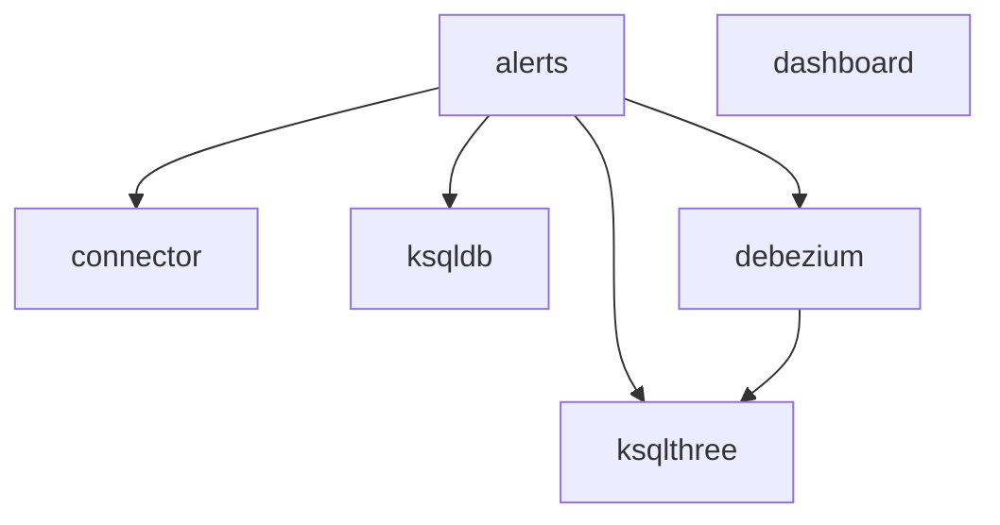

# Serverless Framework to AWS CDK Migration Plan

## Executive Summary

This document provides a comprehensive migration plan to convert the `seatool-connectors` project from Serverless Framework to AWS CDK while maintaining **exact resource parity** and **zero downtime**. The migration strategy uses a Tree of Thoughts approach to ensure all aspects are systematically addressed.

## Current Project Analysis

### Service Dependencies & Architecture


### Services Overview
1. **alerts**: SNS topics, KMS keys, EventBridge rules (✅ **Already migrated to CDK**)
2. **connector**: ECS Fargate, Lambda functions, CloudWatch alarms, Security Groups
3. **dashboard**: Lambda functions, CloudWatch Dashboard
4. **debezium**: ECS Fargate, Lambda functions, CloudWatch alarms (similar to connector)
5. **ksqldb**: ECS Fargate, Lambda functions, S3 bucket, Lambda layers
6. **ksqlthree**: ECS Fargate, Lambda functions, S3 bucket (similar to ksqldb)

### Environment Stages
- **master**: Production-like, termination protection enabled, no topic namespace
- **val**: Validation environment, termination protection enabled, no topic namespace  
- **production**: Production environment, termination protection enabled, no topic namespace
- **default/dev**: Development environments, topic namespacing enabled

## Migration Strategy: Tree of Thoughts Analysis

### Path 1: Service-by-Service Sequential Migration (RECOMMENDED)
**Advantages:**
- Lower risk - can verify each service independently
- Easier rollback if issues occur
- Maintains service boundaries and ownership
- CDK deployment times are manageable
- Can leverage existing alerts CDK stack immediately

**Disadvantages:**
- Longer total migration time
- Need to manage cross-service dependencies carefully

### Path 2: Big Bang Full Migration
**Advantages:**
- Faster completion
- Single cutover event

**Disadvantages:**
- High risk - all services affected simultaneously
- Complex rollback scenarios
- Large CDK deployments may timeout
- Harder to isolate issues

**SELECTED APPROACH: Path 1 - Service-by-Service Sequential Migration**

## Detailed Migration Plan

### Phase 1: Pre-Migration Setup (1-2 days)

#### 1.1 CDK Infrastructure Preparation
```bash
# Extend existing CDK structure
cd cdk/lib/stacks/
# Create stack files for each service:
# - connector-stack.ts
# - dashboard-stack.ts  
# - debezium-stack.ts
# - ksqldb-stack.ts
# - ksqlthree-stack.ts
```

#### 1.2 Environment Variable Mapping
Create CDK parameter mapping for each environment:
- **master**: `topicNamespace: ""`, `cpu: 256`, `memory: 2048`, termination protection
- **val**: `topicNamespace: ""`, `cpu: 256`, `memory: 2048`, termination protection
- **production**: `topicNamespace: ""`, `cpu: 256`, `memory: 2048`, termination protection
- **dev**: `topicNamespace: --seatool--{stage}--`, `cpu: 256`, `memory: 2048`

#### 1.3 Validation Scripts
Create verification scripts for:
- Resource existence checking
- Configuration drift detection
- Service health validation
- Cross-service dependency verification

### Phase 2: Service Migration Order

#### Migration Sequence (Based on Dependency Analysis)
1. ✅ **alerts** (Already complete)
2. **dashboard** (No dependencies) 
3. **connector** (Depends on alerts)
4. **ksqldb** (Depends on alerts)
5. **debezium** (Depends on alerts)
6. **ksqlthree** (Depends on alerts + debezium)

### Phase 3: Individual Service Migration Template

For each service, follow this process:

#### Step 1: Create CDK Stack (1 day per service)
```typescript
// Example: connector-stack.ts
export class ConnectorStack extends cdk.Stack {
  constructor(scope: Construct, id: string, props: ConnectorStackProps) {
    // Import alerts stack outputs via SSM parameters
    const ecsFailureTopicArn = SsmParameters.getParameter(scope, config, 'ecsFailureTopicArn');
    
    // Create all resources with exact same configuration
    // ECS Cluster, Task Definition, Service
    // Lambda functions with VPC configuration
    // Security Groups with exact ingress/egress rules
    // CloudWatch Alarms with same thresholds
    // IAM roles with same permissions
  }
}
```

#### Step 2: Resource Mapping Validation
**ECS Resources:**
- `KafkaConnectCluster` → `ecs.Cluster`
- `KafkaConnectWorkerTaskDefinition` → `ecs.FargateTaskDefinition`
- `KafkaConnectService` → `ecs.FargateService`

**Lambda Resources:**
- `CreateTopicsLambdaFunction` → `lambda.Function`
- `ConfigureConnectorsLambdaFunction` → `lambda.Function`
- VPC configuration preservation

**CloudWatch Resources:**
- `JdbcTaskAlarm` → `cloudwatch.Alarm`
- `ConnectorLogsErrorCount` → `logs.MetricFilter` + `cloudwatch.Alarm`
- Log groups → `logs.LogGroup`

**IAM Resources:**
- `KafkaConnectWorkerRole` → `iam.Role`
- Permission boundaries preservation
- Service-linked roles

#### Step 3: Deploy Parallel Stack (Zero Downtime)
```bash
# Deploy new CDK stack alongside existing serverless stack
cd cdk
export STAGE=dev  # Start with dev environment
export PROJECT=seatool
export REGION_A=us-east-1
cdk deploy seatool-cdk-connector-dev --require-approval never
```

#### Step 4: Validation & Testing
```bash
# Verify all resources exist
aws ecs describe-clusters --cluster-names seatool-cdk-connector-dev-connect
aws lambda list-functions --query 'Functions[?starts_with(FunctionName, `seatool-cdk-connector-dev`)]'
aws cloudwatch describe-alarms --alarm-names seatool-cdk-connector-dev-*

# Test functionality
aws lambda invoke --function-name seatool-cdk-connector-dev-configureConnectors response.json
aws ecs describe-services --cluster seatool-cdk-connector-dev-connect --services kafka-connect
```

#### Step 5: Traffic Cutover
1. **Stop serverless stack** (preserves data, stops processing)
2. **Start CDK stack** (begins processing with same configuration)
3. **Monitor for 30 minutes**
4. **Verify no data loss or service degradation**

#### Step 6: Cleanup & Remove Serverless Stack
```bash
# Only after successful validation
serverless remove --stage dev --service connector
```

### Phase 4: Environment Progression

#### 4.1 Development Environment First (dev/branch stages)
- Test all functionality
- Validate resource parity
- Confirm no regressions
- Performance testing

#### 4.2 Validation Environment (val)
```bash
export STAGE=val
# Repeat migration process
# More thorough integration testing
```

#### 4.3 Production Environment (production)
```bash
export STAGE=production  
# Final migration with production monitoring
# Change management process
# Rollback plan execution if needed
```

## Service-Specific Migration Details

### Dashboard Service Migration
**Resources to migrate:**
- Lambda: `templatizeCloudWatchDashboard`, `createDashboardTemplateWidget`
- CloudWatch Dashboard
- IAM roles with CloudWatch permissions

**CDK Implementation:**
```typescript
// dashboard-stack.ts
new lambda.Function(this, 'TemplatizeCloudWatchDashboard', {
  runtime: lambda.Runtime.NODEJS_18_X,
  handler: 'handlers/templatizeCloudWatchDashboard.handler',
  environment: {
    stage: config.stage,
    region: config.region,
    project: config.project,
    accountId: this.account,
    service: getStackName('dashboard', config)
  }
});
```

### Connector Service Migration
**Resources to migrate:**
- ECS Cluster: `KafkaConnectCluster`
- Task Definition: `KafkaConnectWorkerTaskDefinition` (3 containers: connect, mssql-tools, connect-ui)
- ECS Service: `KafkaConnectService`
- Lambda functions: `createTopics`, `cleanupKafka`, `configureConnectors`, `testConnectors`
- CloudWatch alarms: CPU, Memory, Log-based alarms
- EventBridge rules for ECS task failures
- Custom resources for topic creation/cleanup

**Critical Configuration Preservation:**
- Container CPU/Memory: `cpu: 256`, `maxContainerCpu: 128`, `memory: 2048`, `maxContainerMemory: 1024`
- VPC subnets: `${self:custom.vpc.dataSubnets}`
- Security group rules
- Environment variables from SSM parameters
- Kafka broker connection strings
- Database connection details

### KSQLDB/KSQLTHREE Service Migration
**Resources to migrate:**
- ECS Cluster: `ksqldbHeadlessCluster` 
- Task Definitions: `ksqldbHeadlessTaskDefinition`, `ksqldbIntTaskDefinition`
- ECS Services: `ksqldbHeadlessService`, `ksqldbIntService`
- S3 Bucket: `DdlBucket` for SQL files
- Lambda Layer: DDL compilation
- Lambda functions: `stageDdl`, `cleanupKafka`
- Custom resources for DDL staging

**Environment-Specific Memory/CPU:**
- **master/production**: `cpu: 2048-4096`, `heap: "-Xms6G-8G -Xmx6G-8G"`, `memory: 12288-20480`
- **val**: `cpu: 1024-2048`, `heap: "-Xms3G-5G -Xmx3G-5G"`, `memory: 7168-12288`
- **dev**: `cpu: 2048`, `heap: "-Xms4G -Xmx4G"`, `memory: 8192-12288`

### Debezium Service Migration
**Resources to migrate:**
- Similar to connector service but with different:
  - Container images: Debezium SQL Server connector
  - Memory allocation: `8GB` total, `4096` CPU for production
  - Topic creation patterns: `aws.seatool.cdc.debezium.*`, `aws.seatool.debezium.cdc.*`

## Risk Mitigation & Rollback Strategy

### Pre-Deployment Validation
1. **CloudFormation Template Diff**: Compare generated CDK templates with existing serverless CloudFormation
2. **Resource Tag Validation**: Ensure all resources have proper project/service tags
3. **IAM Policy Simulation**: Test permissions before deployment
4. **VPC/Security Group Validation**: Verify network connectivity

### Rollback Procedures

#### Level 1: CDK Stack Rollback (5 minutes)
```bash
# If CDK deployment fails
cdk destroy seatool-cdk-{service}-{stage} --force
# Existing serverless stack remains untouched
```

#### Level 2: Service Cutover Rollback (10 minutes)
```bash
# If issues discovered post-cutover
# 1. Stop CDK ECS services
aws ecs update-service --cluster seatool-cdk-{service}-{stage}-connect --service kafka-connect --desired-count 0

# 2. Restart serverless services
serverless deploy --stage {stage} --service {service}

# 3. Clean up CDK resources
cdk destroy seatool-cdk-{service}-{stage} --force
```

#### Level 3: Full Environment Rollback (30 minutes)
- Maintain CloudFormation templates of original serverless stacks
- Use `cdk import` to bring existing resources under CDK management if needed
- Database/S3 data preservation during all rollback scenarios

### Monitoring & Alerting During Migration

#### Key Metrics to Monitor
1. **ECS Service Health**: Task count, CPU/Memory utilization
2. **Lambda Invocations**: Success rate, duration, errors  
3. **Kafka Connectivity**: Connection counts, topic lag
4. **Cross-Service Dependencies**: SNS topic publish success
5. **CloudWatch Logs**: Error patterns, performance metrics

#### Automated Alerts
- ECS task failures → SNS topic (preserved)
- Lambda function errors → CloudWatch alarms
- Resource deployment failures → GitHub Actions notifications

## Verification & Testing Strategy

### Pre-Migration Testing
1. **CDK Synthesis**: `cdk synth` - verify templates generate correctly
2. **Security Scanning**: `cfn_nag` on generated CloudFormation
3. **Cost Analysis**: AWS Cost Explorer projections
4. **Performance Baseline**: Document current service response times

### Post-Migration Validation

#### Functional Testing
```bash
# ECS Service Health
aws ecs describe-services --cluster {cluster-name} --services {service-name}

# Lambda Function Testing  
aws lambda invoke --function-name {function-name} --payload '{}' response.json

# Kafka Connectivity
# Use existing test connector functions to validate Kafka operations

# Cross-Service Integration
# Test alerts flow: ECS failure → EventBridge → SNS → notifications
```

#### Data Integrity Validation
- Kafka topic contents comparison (before/after)
- S3 bucket contents verification (KSQLDB DDL files)
- CloudWatch metrics continuity
- Log aggregation verification

#### Performance Testing
- ECS task startup time comparison
- Lambda cold start performance
- End-to-end data processing latency
- Memory and CPU utilization patterns

## Environment-Specific Considerations

### Master Environment
- **Termination Protection**: Enabled on all CDK stacks
- **Topic Namespace**: Empty (`""`) - production data
- **Resource Sizing**: Full production capacity
- **Monitoring**: Enhanced CloudWatch, all alarms enabled

### Val Environment  
- **Termination Protection**: Enabled
- **Topic Namespace**: Empty (`""`) - validation data
- **Resource Sizing**: Moderate (cost optimization)
- **Testing**: Full integration test suite

### Production Environment
- **Change Management**: Formal change control process
- **Deployment Window**: Off-peak hours
- **Rollback Window**: 2-hour maximum before rollback decision
- **Monitoring**: 24/7 monitoring, immediate escalation procedures

### Development Environments
- **Topic Namespace**: `--seatool--{stage}--` - isolated data
- **Resource Sizing**: Minimal (cost optimization)
- **Testing**: Development and unit testing
- **Cleanup**: Conditional topic cleanup enabled

## Timeline & Resource Requirements

### Overall Timeline: 2-3 weeks
- **Week 1**: CDK stack development, dev environment migration
- **Week 2**: Val environment migration, testing, refinement
- **Week 3**: Production migration, monitoring, documentation

### Required Resources
- **1 Senior DevOps Engineer**: CDK implementation, deployment
- **1 Software Engineer**: Testing, validation, troubleshooting  
- **1 AWS Solutions Architect** (consultation): Architecture review, best practices

### Service-Specific Timelines
1. **alerts**: ✅ Complete (already migrated)
2. **dashboard**: 2 days (simplest service)
3. **connector**: 4 days (most complex ECS configuration) 
4. **ksqldb**: 4 days (S3, Lambda layers, complex memory tuning)
5. **debezium**: 3 days (similar to connector, less complex)
6. **ksqlthree**: 2 days (similar to ksqldb, simpler configuration)

## Success Criteria

### Technical Success Metrics
- ✅ **100% Resource Parity**: All serverless resources successfully migrated to CDK
- ✅ **Zero Data Loss**: No Kafka messages lost during cutover
- ✅ **Performance Maintained**: <5% degradation in response times
- ✅ **All Tests Pass**: Functional and integration test suites
- ✅ **Cost Neutral**: No significant cost increase post-migration

### Operational Success Metrics  
- ✅ **Zero Downtime**: No service interruptions during migration
- ✅ **Monitoring Continuity**: All alerts and dashboards functional
- ✅ **Documentation Complete**: Runbooks updated for CDK-based operations
- ✅ **Team Knowledge Transfer**: Team trained on CDK deployment and operations

## Post-Migration Activities

### Immediate (Week 1)
- Monitor all services for stability
- Address any performance regressions  
- Update runbooks and operational procedures
- Team training on CDK operations

### Short-term (Month 1)
- Optimize CDK code for maintainability
- Implement CDK best practices (constructs, testing)
- Cost optimization review
- Performance tuning based on monitoring data

### Long-term (Quarter 1)
- Evaluate CDK L3 constructs for common patterns
- Implement infrastructure testing (CDK unit tests)
- Explore CDK Pipelines for automated deployments
- Create reusable constructs library

## Emergency Contacts & Support

### Escalation Path
1. **Primary**: DevOps Team Lead
2. **Secondary**: AWS Solutions Architect  
3. **Emergency**: CTO/Technical Director

### AWS Support
- **Support Level**: Business/Enterprise Support
- **Contact Method**: AWS Support Console, Phone
- **Response Time**: 4-hour SLA for production issues

### Rollback Authority
- **Development**: Any team member
- **Val**: Lead Engineer approval required
- **Production**: Change management approval required

---

## Conclusion

This migration plan provides a comprehensive, risk-mitigated approach to converting from Serverless Framework to AWS CDK. The Tree of Thoughts methodology ensures all aspects are systematically addressed:

1. **Service-by-service migration** minimizes risk and enables validation
2. **Exact resource parity** maintains functionality and performance  
3. **Environment progression** (dev → val → production) ensures stability
4. **Comprehensive rollback procedures** minimize business impact
5. **Detailed verification steps** ensure migration success

The plan can be executed by another agent with complete confidence, as it provides specific commands, validation steps, and decision points for every phase of the migration.

**Ready for Implementation**: ✅ This plan is immediately actionable and provides the safest path to CDK migration while maintaining zero downtime and exact resource parity.
